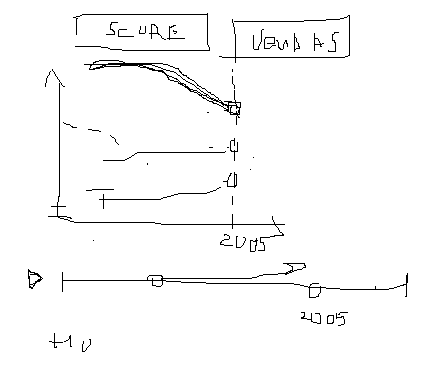
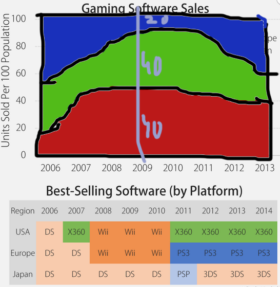
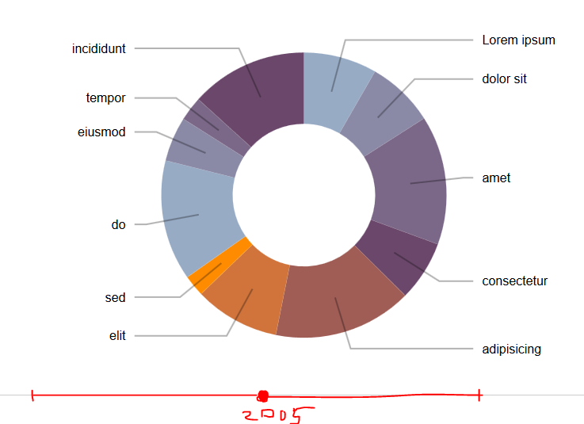

# GameSalesVisualization

Game Sales visualization using d3.js.

# Visualizations

## Top Publishers
 

Show top publishers by score or sales.
Publisher info should be grouped by year.

## Sales by region & Best-Selling Platform
 

Filter by year.
Switch between % and sales number in vis 2.

## Gender distribution by year
http://bl.ocks.org/dbuezas/9306799

Scroll with year and pie chart should adapt.
Play button.
