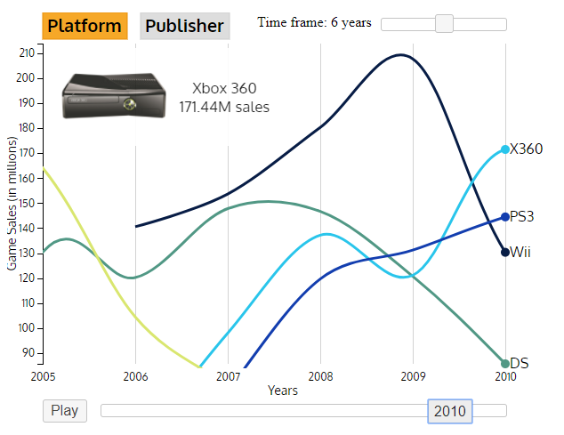

# GameSalesVisualization

Game Sales visualization using d3.js.

Authors:
- Tiago Almeida
- Yuriy Muryn

# Visualization

## Top 10 Games
This visualization shows the top 10 games based on global sales or user/critic ratings for a specified time period.
 

## Game sales over time
This visualization shows the game sales through years. The bars are stacked so it can be easy to visualize global sales and the user can also view the data for a single region (Europe, North America, Japan or Rest of the World). It is also possible to view the sales as a percentage for a given year, making it easier to identify the region with most sales for that year.
 

## Platform and Publisher Sales through time
At last, in this visualization is presented the evolution of the platforms or publisheres with most video game sales (top 4 when possible) through the years, like an interactive video.

